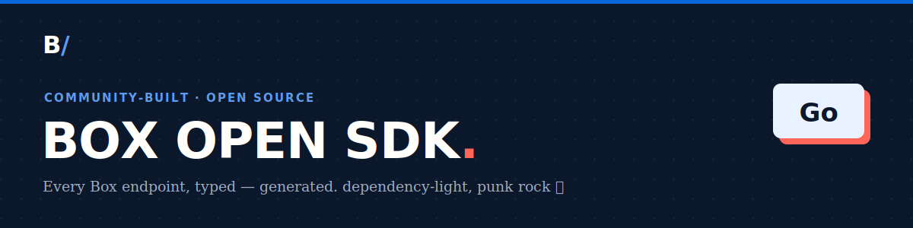

<!-- Generated by box-gantry. DO NOT EDIT — regenerate from the specs instead. -->


# box-open-sdk (Go)

[](https://pkg.go.dev/github.com/unofficialbox/box-open-go-sdk)

A **community, unofficial** Box API client for Go — typed models for the whole
Box surface, one manager per API area behind a single `Client`, and a
`net/http` runtime with retry, exponential backoff, `Retry-After` handling, and
automatic token refresh. Standard library only; no third-party dependencies.

> **Not affiliated with, authorized, or endorsed by Box, Inc.** "Box" is a
> trademark of Box, Inc. This is an independent, generated client.

## Install

```sh
go get github.com/unofficialbox/box-open-go-sdk@latest
```

## Quickstart

```go
package main

import (
	"context"
	"fmt"
	"log"

	"github.com/unofficialbox/box-open-go-sdk/client"
	"github.com/unofficialbox/box-open-go-sdk/gantryruntime"
)

func main() {
	// Developer token for a quick start; CCG, OAuth, and JWT are also supported.
	c := client.NewClient(gantryruntime.DeveloperToken("DEVELOPER_TOKEN"))

	// Every API area is a manager on the client.
	me, err := c.Users.GetMe(context.Background(), nil)
	if err != nil {
		log.Fatal(err)
	}
	fmt.Println(me)

	// List endpoints return a range-over-func iterator (Go 1.23+); paging is
	// automatic.
	for user, err := range c.Users.List(context.Background(), nil) {
		if err != nil {
			log.Fatal(err)
		}
		fmt.Println(user.Id)
	}
}
```

## Authentication

The runtime implements Box's four auth flows — **developer token**, **client
credentials (CCG)**, **OAuth 2.0** (with a pluggable refresh-token store), and
**JWT** (server auth). See [`docs/auth.md`](./docs/auth.md).

## Documentation

API reference on [pkg.go.dev](https://pkg.go.dev/github.com/unofficialbox/box-open-go-sdk); the [`docs/`](./docs)
tree carries the per-manager reference and the authentication, pagination, and
errors guides.

## License

MIT. Generated by [box-gantry](https://github.com/unofficialbox/box-gantry).
